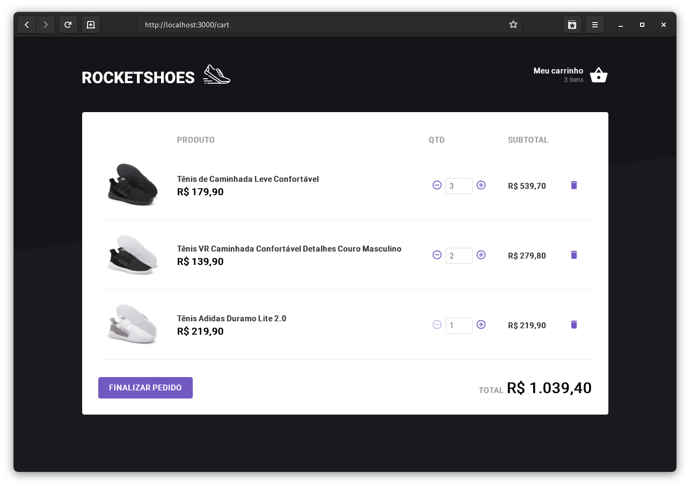

<h1 align="center">dt money</h1>

#### Ignite

## Sobre o desafio

O desafio consistiu em fazer a lógica do carrinho de compras de uma loja fictícia chamada Rocketshoes.

---

## Testes no qual passou

- Home Page should be able to render each product quantity added to cart
- Home Page should be able to add a product to cart
- useCart Hook should be able to initialize cart with localStorage value
- useCart Hook should be able to add a new product
- useCart Hook should not be able add a product that does not exist
- useCart Hook should be able to increase a product amount when adding a product that already exists on cart
- useCart Hook should not be able to increase a product amount when running out of stock
- useCart Hook should be able to remove a product
- useCart Hook should not be able to remove a product that does not exist
- useCart Hook should be able to update a product amount
- useCart Hook should not be able to update a product that does not exist
- useCart Hook should not be able to update a product amount when running out of stock
- useCart Hook should not be able to update a product amount to a value smaller than 1
- Cart Page should be able to increase/decrease a product amount
- Cart Page should not be able to decrease a product amount when value is 1
- Cart Page should be able to remove a product
- Header Component should be able to render the amount of products added to cart

---

## Como contribuir

- Crie um fork deste repositório
- Faça uma branch com a sua feature: `git checkout -b minha-feature`;
- Envie suas alterações: `git commit -m 'feat: Minha nova feature'`;
- Faça um push para a sua branch: `git push origin minha-feature`.
